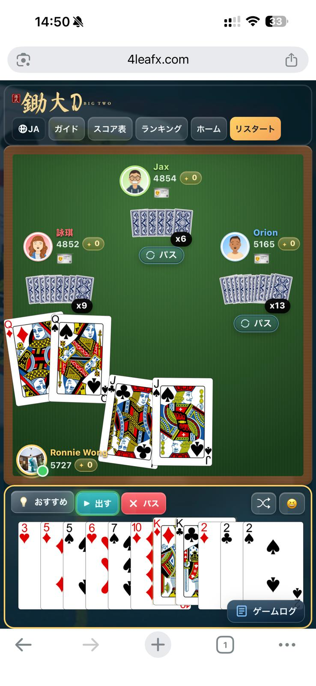

# UI Regression Checklist

Run this checklist after any UI change that touches layout, floating UI, or touch interaction.

## Language Menu
- Home screen: open language menu, select a language, confirm dropdown disappears.
- Game screen: open language menu, select a language, confirm dropdown disappears.
- Web view/mobile: repeat language selection and confirm no orphaned dropdown remains visible.
- Tablet portrait game screen: language trigger stays aligned with the topbar row and dropdown opens centered under the trigger.
- Tablet landscape game screen: language trigger stays aligned with the topbar row and dropdown opens without clipping or shifting the button row.

## South Player Area
- Mobile: south player badge stays anchored to the green table bottom-left.
- South player callout uses the intended mobile-style placement.
- South player callout tail stays attached and aligned after play/pass/last-card callouts.

## Opponent Callouts
- North callout tail stays attached when the callout is pushed onscreen.
- East/west callout tails stay attached when the callout is pushed onscreen.
- Emote callouts move together with their tails when shifted onscreen.

## Hand And Action Area
- Selected hand cards do not hide cards to the right.
- Must-3 highlight does not break hand stacking.
- Action buttons remain usable in portrait and landscape.

## Layout
- Portrait mode game layout renders correctly.
- Landscape mode game layout renders correctly.
- Narrow desktop: topbar does not overlap the game log.
- Tablet portrait: topbar buttons stay aligned, centered, and fully tappable.
- Tablet landscape: topbar buttons stay aligned and the side log keeps clean spacing.
- Tablet portrait and landscape: leaderboard, guide, home, and restart buttons remain visible and usable.
- Prevent unwanted page scrollbar whenever possible.

## Final Check
- Run `npm run build`.
